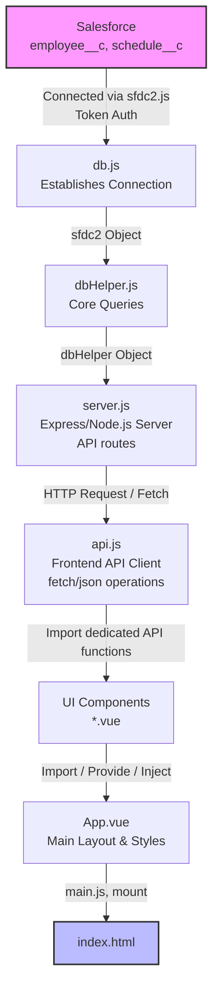

# Web Work Calendar

Gabriele La Vista - 4H ITIS FERMI, Modena - FSO 11/05 - 22/05/2026.
A web calendar using Vue and JS to display and manage shared schedules and employees, based on a Salesforce database. 

## Overview 

**Web Work Calendar** is a full-stack web application (Vue.js + Node.js) designed to streamline and automate the management of employee office presence and remote work schedules. Replacing manual spreadsheet tracking, the app dynamically synchronizes employee data, shifts, and attendance statuses directly with a cloud-based Salesforce CRM in real time.

## Application workflow
The following map outlines the architecture, data flow, and component dependencies across the application stack:



## Tech Stack & Infrastructure

| Technology / Tool | Category | Description |
| :--- | :--- | :--- |
| **Vue.js** | Frontend Framework | JavaScript framework used for building the user interface. |
| **Node.js** | Backend Runtime | JavaScript server-side runtime environment. |
| **Salesforce** | CRM & Database | Core data store handling `employee__c` and `schedule__c` objects. |
| **sfdc2.js** | Integration Library | Library for secure Salesforce connection using token authentication. |
| **git.gnet.it** | Version Control | Source code management and repository hosting. |


## Key Features
- **Interactive Calendar:** View and manage weekly schedules with an intuitive UI.
- **Bulk Apply:** Quickly assign the same status (e.g., "Remote", "Office") to an employee for an entire working week.
- **Employee Management:** Add, update, or deactivate employee profiles and set their working periods.
- **Real-time Sync:** All changes are immediately saved to Salesforce without needing local databases.
- **Responsive Design:** Fully usable on both desktop and mobile devices.

## Getting Started

### Prerequisites
- [Node.js](https://nodejs.org/) (v22 or higher recommended)
- A Salesforce Developer/Sandbox account
- [Docker](https://www.docker.com/) (optional, for containerized deployment)

### Environment Variables
To connect the application to Salesforce, create a `.env` file in the root directory (refer to `.env.example`):

```env
CLIENT_ID=<YOUR_SALESFORCE_CLIENT_ID>
CLIENT_SECRET=<YOUR_SALESFORCE_CLIENT_SECRET>
VITE_URL=<API_CALLS_URL>
FRONTEND_URL=<API_REQUESTS_URL>
PORT=<>
SF_TOKEN=<(Optional) Your token object>
```

### Local Installation
1. Clone the repository and navigate to the project folder.
2. Install dependencies for both frontend and backend:
   ```bash
   npm install
   cd backend
   npm install
   ```
3. Build the frontend and start the backend server:
   ```bash
   npm run build
   cd backend
   node server.js
   ```
   *Note: On the first run, check the terminal for the Salesforce OAuth2 login link.*
   
### Docker Deployment
You can easily run the application using Docker:

1. Build the Docker image:
   ```bash
   docker build -t web-work-calendar .
   ```
2. Run the container (make sure your `.env` file is ready):
   ```bash
   docker run -p 3000:3000 --env-file .env web-work-calendar
   ```
3. Access the application at `http://localhost:3000`.

---
### Feedbacks from users
- Button to clear the starting/end date (the webkit calendar is not clear enough)
- Button/toast to save current calendar changes; redundant (as the DB automatically saves on change), but provides positive feedback
- Green and orange badges could be better
- Automatically detect system theme and apply it to the UI
- Switch between months/multiple weeks through a calendar view or via buttons to skip 1 month forward/backward
- Invert next/previous week buttons? Change to inline view?
- Apply Bulk applies the status to Saturday and Sunday too - this is impractical
- The interface is only available in English, which may not suit all users.